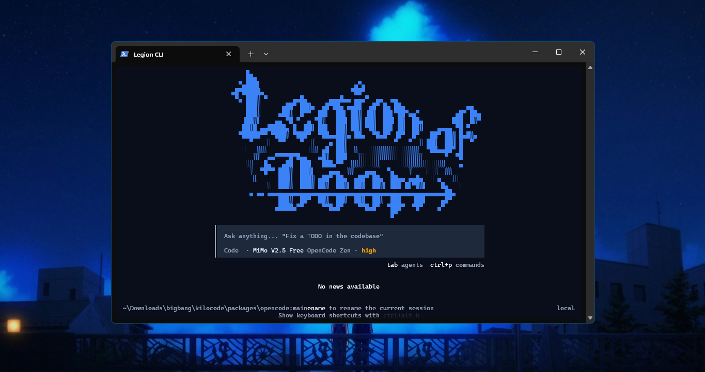

<p align="center">
  
  <h1 align="center">Legion CLI</h1>
  <p align="center">The open source AI coding agent for building with AI.</p>
</p>

<p align="center">
  <a href="https://www.npmjs.com/package/@legioncli/cli"></a>
  <a href="https://x.com/legioncode"></a>
  <a href="https://legion.ai/discord"></a>
  <a href="https://www.reddit.com/r/legioncode/"></a>
</p>

---

Legion CLI is an open source AI coding agent. You pick from 500+ models, switch between them mid-task, and pay the model provider's rate with zero markup. No API keys required to start.

### Installation

```bash
# npm
npm install -g @legioncli/cli

# curl
curl -fsSL https://legion.ai/cli/install | bash

# pnpm
pnpm add -g @legioncli/cli

# bun
bun add -g @legioncli/cli

# Homebrew (macOS / Linux)
brew install Legion-Org/tap/blitz

# Arch Linux (AUR)
paru -S legion-bin
```

Then run `legion` in any project directory to start.

<details>
<summary>Install from GitHub Releases (binaries)</summary>

Download the latest binary from the [Releases page](https://github.com/preetbiswas12/Blitz/releases).

| Platform | Asset |
|---|---|
| Windows (most PCs) | `legion-windows-x64.zip` |
| Windows (ARM) | `legion-windows-arm64.zip` |
| macOS (Apple Silicon) | `legion-darwin-arm64.zip` |
| macOS (Intel) | `legion-darwin-x64.zip` |
| Linux x64 | `legion-linux-x64.tar.gz` |
| Linux ARM | `legion-linux-arm64.tar.gz` |
| Linux x64 (musl/Alpine) | `legion-linux-x64-musl.tar.gz` |
| Linux ARM (musl/Alpine) | `legion-linux-arm64-musl.tar.gz` |

</details>

### Agents

Legion CLI ships with specialized agents you switch between depending on the task. You can also build your own custom agents.

- **Code** - The default. Implements and edits code from natural language.
- **Plan** - Designs architecture and writes implementation plans before any code gets written.
- **Ask** - Answers questions about your codebase without touching any files.
- **Debug** - Troubleshoots and traces issues.
- **Review** - Reviews your changes and surfaces issues across performance, security, style, and test coverage.

Learn more about [agents and custom agents](https://legion.ai/docs/code-with-ai/agents/using-agents).

### What it does

- **Code generation** from natural language, across multiple files.
- **Self-checking** so the agent reviews and corrects its own work.
- **Terminal and browser control** to run commands and automate the web.
- **MCP marketplace** to find and wire up MCP servers that extend what the agent can do.
- **500+ models** with mid-task switching, so you can match latency, cost, and reasoning to the job.
- **Codebase indexing** with tree-sitter for fast, accurate code navigation and understanding.
- **Sandbox execution** for safely running untrusted code in isolated environments.

### Autonomous Mode (CI/CD)

Run `legion run` with `--auto` for fully autonomous operation with no prompts, built for CI/CD pipelines:

```bash
legion run --auto "run tests and fix any failures"
```

`--auto` disables all permission prompts and lets the agent execute any action without confirmation. Only use it in trusted environments.

### Documentation

For configuration and everything else, [head over to the docs](https://legion.ai/docs).

### Contributing

Contributions are welcome from developers, writers, and everyone in between. Start with the [Contributing Guide](/CONTRIBUTING.md) for environment setup, coding standards, and how to open a pull request.

Please review our [Code of Conduct](/CODE_OF_CONDUCT.md) before getting involved.

### License

MIT. You're free to use, modify, and distribute this code, including commercially, as long as you keep the attribution and license notices. See [License](/LICENSE).

### FAQ

<details>
<summary>Where did Legion CLI come from?</summary>

Legion CLI is a fork of [OpenCode](https://github.com/anomalyco/opencode), enhanced to work as a standalone BYOK (Bring Your Own Key) coding agent with additional features like codebase indexing, sandbox execution, and a built-in console.

</details>

<details>
<summary>What models are supported?</summary>

Legion CLI supports 500+ models through multiple providers including Anthropic, OpenAI, Google, OpenRouter, and more. You can bring your own API keys or use the built-in provider routing. Switch models mid-task with `/model`.

</details>

---

**Join the community** [Discord](https://legion.ai/discord) | [X](https://x.com/legioncode) | [Reddit](https://www.reddit.com/r/legioncode/)